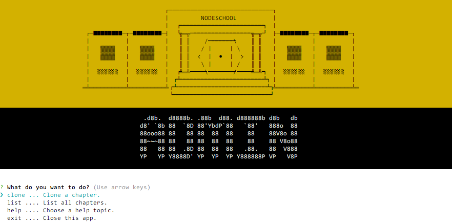

# NodeSchool Admin CLI Tool

Welcome to [NodeSchool](http://nodeschool.io)

`nodeschool-admin` is a CLI tool that should help you get your work done on NodeSchool.

## Installation

`npm i nodeschool-admin -g`

## Usage

Start the script by running `nodeschool-admin` in your terminal.

This tool has **two modes** depending on **the folder** in which it is executed!

## Requirements

* Minimum [Git](https://git-scm.com/) Version 2.0
* [Node LTS](https://nodejs.org/en/download/)

## Chapter Mode

To be in `Chapter Mode` you need to move your terminal location to a folder
that contains a git repository with a
[remote](https://git-scm.com/docs/git-remote) pointing to the repo of your
NodeSchool chapter.

## Standard mode

The `Standard Mode` is active in every folder **except** folders that works
for [`Chapter Mode`](#chapter-mode).

The application will show a nice dialog to choose your commands from there on.

Cheers.

## Develop

* Fork the repository
* Run with the following command
  `node ./bin/nodeschool-admin -p <full path to your chapter folder>`
* Happy coding
